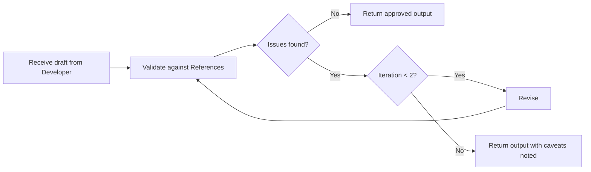

# Code review

Type: [Loop](./references/workflow-types.md)

This workflow validates written code against reference documents and acceptance criteria before it is treated as complete. It applies to any trivial code task.

---

## When to use

- when the [Developer](../agents/developer.md) agent produces code draft
- when any component is created, changed, or composed

---

## References

- relevant [skills/](../skills/)
- relevant [commands/](../commands/)
- relevant [docs/code](../docs/code)

---

## Checklist

- [ ] accessibility is correct (semantics, labels, keyboard reachability, contrast...)

---

## Sequence

1. receive draft from the [Developer](../agents/developer.md)
2. validate against the [References](code-review#References)
3. record issues found
4. if issues exist and iteration < 2 → revise and return to step 2
5. if issues exist and iteration = 2 → return output with caveats noted
6. if no issues → return approved output
