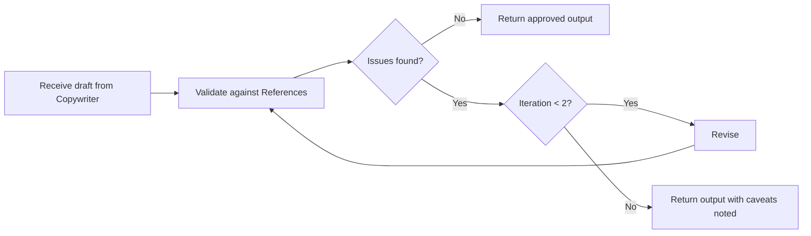

# Copy review

Type: [Loop](./references/workflow-types.md)

This workflow validates written content against reference documents and acceptance criteria before it is treated as complete. It applies to any non-trivial copy task, including multiple text elements, full-page copy, documentation, and legal text.

---

## When to use

- when the [Copywriter](../agents/copywriter.md) agent produces text draft more than a single label or one-line change
- when the copy covers multiple states (empty, error, success, loading)

---

## References

- relevant [skills/](../skills/)
- relevant [commands/](../commands/)
- relevant [docs/copy/](../docs/copy/)
- [Microcopy](../docs/copy/copy-microcopy.md)

---

## Sequence

1. receive draft from the [Copywriter](../agents/copywriter.md)
2. validate against the [References](copy-review#References)
3. record issues found
4. if issues exist and iteration < 2 → revise and return to step 2
5. if issues exist and iteration = 2 → return output with caveats noted
6. if no issues → return approved output
