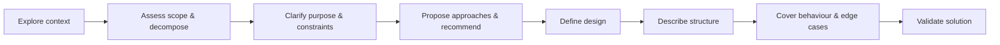

# Design process

Type: [Pipeline](./workflow-types.md)

This workflow turns an idea or requirement into a validated design before implementation starts, ensuring that purpose, constraints, assumptions, and trade-offs are clear before any code is written. It applies to every task that introduces new behaviour, a new screen, or any non-trivial change, including work that appears simple at first glance.

---

## When to use

- when a new feature, flow, or screen is being considered
- when the scope is unclear or multiple approaches are possible
- when the implementation affects multiple files or domains
- when a requirement must be decomposed before planning

---

## Sequence

1. explore the current context to understand the task, relevant constraints, and existing patterns
2. assess scope and decompose the work if the request contains multiple independent problems or subsystems
3. clarify purpose, constraints, assumptions, and success criteria before proposing a solution
4. propose possible approaches, compare trade-offs, and recommend one direction
5. define the design at the appropriate level of detail for the task complexity
6. describe the structure of the solution, including responsibilities, boundaries, interactions, and dependencies
7. cover key behaviour, states, data flow, edge cases, error handling, and testing considerations
8. validate the solution for clarity, completeness, and maintainability

---

## Design quality check

For each unit in the design, verify the following:

- its purpose is clear
- its usage is clear
- its dependencies are clear
- its responsibility can be understood without reading its internals
- its internals can change without breaking consumers

---

## Working in existing codebases

<constraints>
	Do not propose unrelated refactoring.	
</constraints>

- explore the existing structure first
- follow established patterns
- when existing code issues directly affect the task, include targeted improvements
