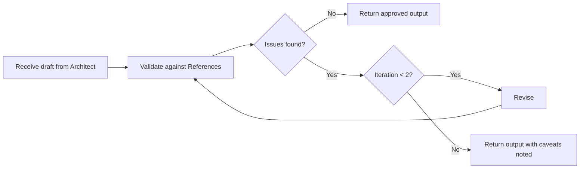

# Design review

Type: [Loop](./references/workflow-types.md)

This workflow validates UI design draft against reference documents and acceptance criteria before it is treated as complete. It applies to any trivial design task.

---

## When to use

- when the [Architect](../agents/architect.md) agent produces design draft
- when any component is created, changed, or composed

---

## References

- relevant [skills/](../skills/)
- relevant [commands/](../commands/)
- relevant [docs/design](../docs/design)

---

## Checklist

- [ ] component fits the design system cleanly (colors, typography)
- [ ] UI architecture is correct (page structure, state completeness, responsiveness...)

---

## Sequence

1. receive draft from the [Architect](../agents/architect.md)
2. validate against the [References](design-review#References)
3. record issues found
4. if issues exist and iteration < 2 → revise and return to step 2
5. if issues exist and iteration = 2 → return output with caveats noted
6. if no issues → return approved output
