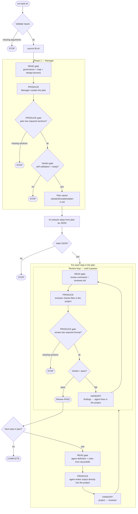
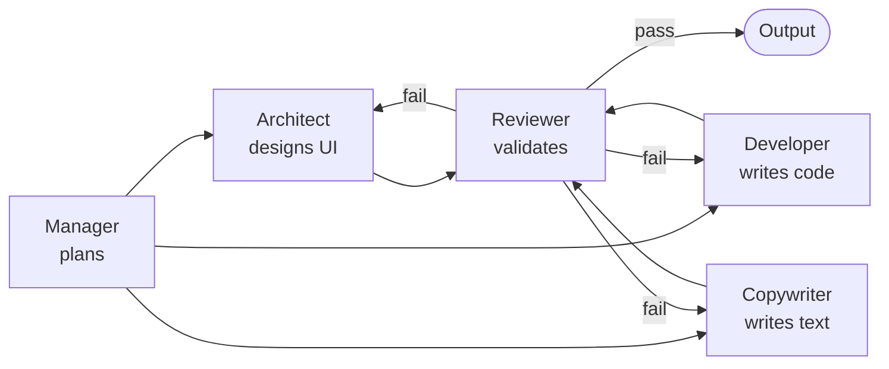
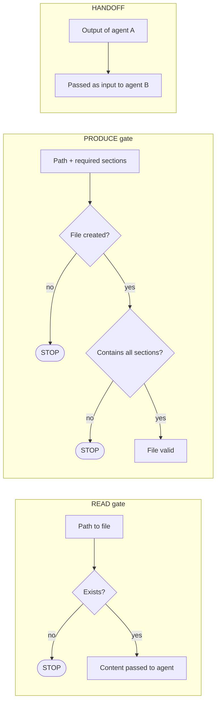
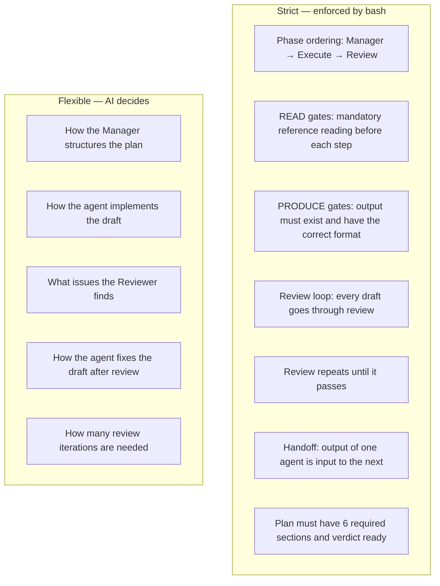
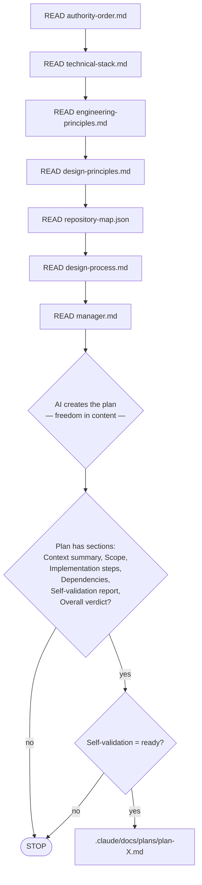
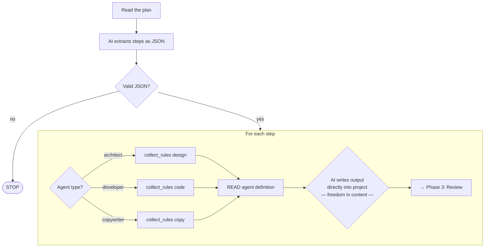
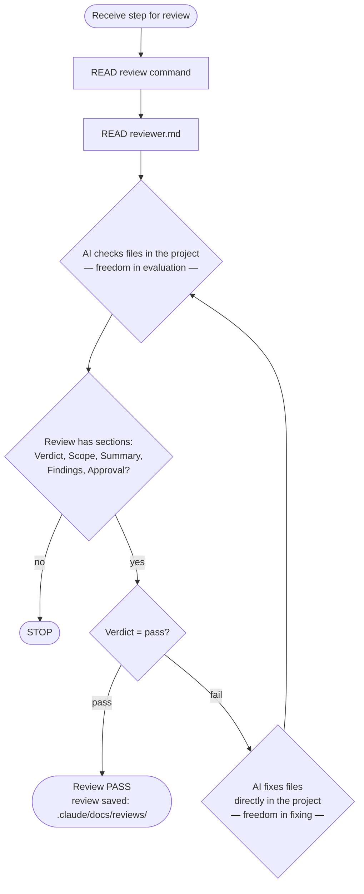

# Webdesign Agents System

This repository defines a set of agents and sub-agents for building and maintaining websites and web applications in Claude Code. It establishes the structure, authority model, and execution flow required to design, build, and validate user interfaces consistently.

---

## Repository map

The complete repository structure is defined here: [Repository map](.claude/repository-map.json)

---

## Technical stack

For every task, use the technologies defined here: [Technical stack](.claude/governance/technical-stack.md)

---

## Sequence

Every non-trivial task (new feature, component, page, multi-file change, redesign, refactor) MUST follow this sequence — NO EXCEPTIONS:

1. resolve authority through [Authority order](.claude/governance/authority-order.md)
2. locate relevant paths through [Repository map](.claude/repository-map.json)
3. start planning with [Manager](.claude/agents/manager.md)
4. for EACH step in the plan: execute with the correct agent (architect/developer/copywriter)
5. after EACH step: run review via [Reviewer](.claude/agents/reviewer.md) — save to `.claude/docs/reviews/review-[step]-v[N].md`
6. if review fails → fix → re-review until pass
7. NEVER skip the review loop — every step gets reviewed before moving to the next

Trivial tasks (simple questions, config changes, single-line fixes) do not require orchestration.

---

## Deterministic orchestration

Bash scripts in `commands/` enforce step ordering, mandatory reference reading, and the review loop. Markdown files alongside them describe the same process for reading and understanding. Bash enforces WHEN, markdown describes WHAT.

### Process overview



### Agents



| Agent | When it enters | Required reading | What it produces |
|-------|----------------|------------------|------------------|
| Manager | Always first | governance, repository-map, design-process | Plan in `.claude/docs/plans/` |
| Architect | Design-type step | `.claude/docs/design/`, skills | Files directly in the project |
| Developer | Code-type step | `.claude/docs/code/`, skills | Files directly in the project |
| Copywriter | Copy-type step | `.claude/docs/copy/`, skills | Files directly in the project |
| Reviewer | After each step | review command, governance, docs, skills | Review in `.claude/docs/reviews/` |

### Three gate types

A gate is a deterministic check — it either passes or stops the process.



### What is strict, what is flexible



### Detailed phase breakdown

#### Phase 1 — Manager



Script: `commands/phase-manager.sh`

#### Phase 2 — Execution



Script: `commands/phase-execute.sh`

#### Phase 3 — Review loop



Script: `commands/phase-review.sh`

### Orchestration files

| File | Purpose |
|------|---------|
| `commands/lib.sh` | Shared gate functions: `read_gate`, `produce_gate`, `review_passed`, `collect_rules` |
| `commands/run-task.sh` | Entry point. Runs phases in order. |
| `commands/phase-manager.sh` | Phase 1: mandatory reading → plan → validation |
| `commands/phase-execute.sh` | Phase 2: plan parsing → step execution → handoff to review |
| `commands/phase-review.sh` | Phase 3: review loop until it passes |

Usage:

```bash
./commands/run-task.sh "hero-redesign" "Redesign the hero section into a two-column layout"
```

### What is saved to disk

| What | Where | When |
|------|-------|------|
| Plan | `docs/plans/plan-[task].md` | After Phase 1 (always) |
| Reviews | `docs/reviews/review-[step]-v[N].md` | After each review iteration (audit trail) |
| Agent outputs | directly in the project (files at the correct locations) | During Phase 2 (agents write directly) |
